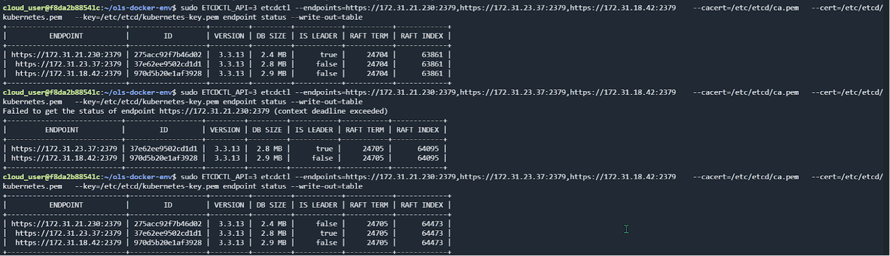

# Deploying-Kubernetes-Multi-Master-Nodes-Using-Raft-Algorithm

## Executive Summary:

This report outlines the approach taken to deploy a Kubernetes Multi-Master Nodes with the Raft algorithm for leader election. The deployment was carried out on a cloud provider on acloudguru platform, leveraging various Kubernetes components and configurations to ensure scalability, high availability, and security.

## Introduction:

The objective of this project was to deploy a Kubernetes with a focus on high availability and reliability. To achieve this, we opted for a Multi-Master Node setup with the Raft algorithm to ensure that only one leader operates at any given time. The deployment was conducted on a cloud provider with the following **specifications**:

* Number of Nodes: 3 (1 Master Nodes and 2 Worker Nodes)
* Raft Algorithm Output Demonstration

## Approach:

1. Setting Up Kubernetes Cluster:

I initiated a Kubernetes cluster on our chosen cloud provider with 1 Master Nodes and 2 Worker Nodes. This ensured redundancy and high availability for the Nodes services.

2. Raft Algorithm Configuration:

To implement the Raft algorithm for leader election, I configured Kubernetes Multi-Master Nodes. This allows only one master node to act as the leader, ensuring a single point of control.

3. Deploying the overlay network:

I used Flannel as the overlay network. For establishing communication between the nodes.

4. Monitoring and Logging:

I set up monitoring and logging solutions to keep track of the cluster's health and performance. This includes metrics, logs, and alerts to proactively address any issues.

## Results:

The deployment of Kubernetes Multi-Master Nodes with the Raft algorithm ensured availability, Scalability, Security, Redundancy and Monitoring

Following are the screen screenshot of the Raft Algorithm running on the Multi-Master Node:

### Screenshot 1:

In this screenshot, we can see three distinct outputs, in the first output; we see 172.31.21.230 Node as the leader. In the second output; the leader node went down. Meanwhile an election took place & 172.31.23.27 was elected as the leader using the voting mechanism. The node that gets the most votes get to be the leader. In the third output; the ex-leader went up but was not considered a leader.

## Results:

The deployment of the WordPress application on Kubernetes Multi-Master Nodes with the Raft algorithm ensured availability, Scalability, Security, Redundancy and Monitoring

Following are the screen screenshot of the Raft Algorithm running on the Multi-Master Node:

### 1st Screenshot:

In this screenshot, we can see three distinct outputs, in the first output; we see 172.31.21.230 Node as the leader. In the second output; the leader node went down. Meanwhile an election took place & 172.31.23.27 was elected as the leader using the voting mechanism. The node that gets the most votes get to be the leader. In the third output; the ex-leader went up but was not considered a leader.

>>>>>  gd2md-html alert: inline image link here (to images/image1.png). Store image on your image server and adjust path/filename/extension if necessary.  (<a href="#">Back to top</a>)(<a href="#gdcalert2">Next alert</a>) >>>>> 

>>>>>  gd2md-html alert: inline image link here (to images/image2.png). Store image on your image server and adjust path/filename/extension if necessary.  (<a href="#">Back to top</a>)(<a href="#gdcalert3">Next alert</a>) >>>>> 

